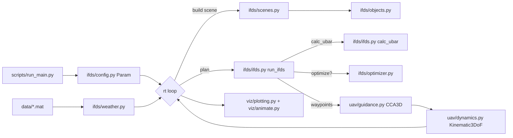

# IFDS-Algorithm — Design Document

Concise developer-focused description of the Python port. Light on math; focuses on
code organization, data flow, and extension points. For the original theory
refer to Komsun Tamanakijprasart's MATLAB notes in `legacy/` and the paper
linked from the project README.

## 1. Overview

IFDS-Algorithm performs **dynamic UAV autorouting** through static and
time-varying obstacle fields with optional environmental (weather) constraints.
Each simulation tick produces:

1. A planned waypoint path from the current UAV position to the destination
   (Interfered Fluid Dynamical System — IFDS).
2. A short UAV trajectory segment along that path via a Carrot-Chasing
   Algorithm (CCA3D) on a 3-DoF kinematic model.

The IFDS planner is decoupled from the UAV dynamics. A `Dynamics` Protocol is
provided so the current `Kinematic3DoF` model can be swapped for a 6-DoF rigid
body model without touching the planner.

Video demo of the MATLAB original:
<https://youtu.be/XtmcNa-w4-0?si=V0FAj7HmrgcvlQuK>

## 2. High-Level Architecture



## 2.1 Configuration layout

Configuration is split into **schema** (Python) and **values** (YAML):

- Schema: `ifds/enums.py`, `ifds/params.py`, `ifds/presets.py` — dataclasses,
  enums, and fixed lookup tables. Not user-editable at runtime.
- Values: `configs/*.yaml` — per-scenario tunable knobs. See
  [`configs/README.md`](../configs/README.md) for the full schema reference.
- Glue: `ifds/config_io.py` — `load_config(path) -> Param`, `dump_config(param, path)`,
  and `apply_overrides(param, **cli_flags) -> Param` for the CLI merge layer.
- Back-compat: `ifds/config.py` re-exports every symbol above so existing
  `from ifds.config import Param, Scene, ...` call sites keep working.

`scripts/run_main.py` follows a **layered** policy: YAML base (`--config PATH`)
then CLI overrides (every individual flag). `--dump-config PATH` writes the
resolved `Param` back out for reproducibility.

## 3. Module Responsibilities

| Package / module | Purpose | Key public symbols | MATLAB replaced |
| --- | --- | --- | --- |
| `ifds/enums.py` | IntEnums | `SimMode`, `OptimizerMode`, `Scene` | MATLAB `simMode`, `useOptimizer`, `scene` constants |
| `ifds/params.py` | Parameter dataclass | `Param` | Parameter block of `main.m` & friends |
| `ifds/presets.py` | Fixed lookup tables | `CCATuning`, `cca_preset`, `num_objects_for_scene` | CCA preset table, scene switch in `IFDS.m` |
| `ifds/config_io.py` | YAML load / dump / override-merge | `load_config`, `dump_config`, `apply_overrides` | *(new; no MATLAB equivalent)* |
| `ifds/config.py` | Back-compat re-export shim | *(same symbols as above)* | *(see modules above)* |
| `ifds/objects.py` | Obstacle dataclass | `Object` | MATLAB `Object(j)` struct |
| `ifds/scenes.py` | Shape factories + scene dispatcher | `build_scene`, `allocate_objects`, `create_{sphere,cylinder,cone,pipe,ceiling}` | `create_scene` & nested helpers in `IFDS.m` |
| `ifds/weather.py` | Weather field loader & interpolators | `WeatherField`, `load_weather_field`, `generate_weather_map` | `initialize_constraint_matrix.m`, `Weather_map_Generator.m` |
| `ifds/optimizer.py` | (rho0, sigma0) optimization | `norm_ubar`, `local_opt_rho_sigma`, `global_optimize_path`, `make_global_objective` | `norm_ubar.m`, `path_opt2` in `IFDS.m`, `path_optimizing` in `main.m` |
| `ifds/ifds.py` | Core algorithm | `calc_ubar`, `ifds_step`, `run_ifds` | `IFDS.m` |
| `uav/guidance.py` | CCA3D carrot-chasing + L1 guidance + PD attitude controller | `cca3d_straight`, `l1_guidance`, `attitude_pd_control`, `sixdof_follow_segment` | `CCA3D_straight.m`; new L1 + PD |
| `uav/dynamics.py` | Dynamics protocol + models | `Dynamics`, `Kinematic3DoF`, `SixDoF`, `QuadMixer`, `quat_*` | inlined EOM in `CCA3D_straight.m`; new 6-DoF rigid body |
| `uav/profiles.py` | Quadrotor parameter profiles | `QuadRotorProfile`, `quadrotor_profile`, `available_profiles` | *(new)* |
| `viz/plotting.py` | 2D/3D plots | `plot_path_2d`, `plot_objects_mpl`, `plot_objects_pyvista`, `plot_scene_mpl`, `plot_weather_contour` | `PlotPath.m`, `PlotObject.m`, `plotting_everything.m` |
| `viz/animate.py` | rt animation & video export | `animate_trajectory` | `figure(69)` animation in `main.m` + `VideoWriter` |
| `viz/uav_marker.py` | UAV marker drawing (quadrotor wireframe / arrow) | `draw_quadrotor`, `draw_arrow` | *(new)* |
| `viz/gamma_plot.py` | Gamma distribution | `plot_gamma_distribution` | `PlotGamma` nested in `main.m`, `main_ALPHA.m`, `main_sg_generation.m` |
| `scripts/run_main.py` | Primary entry point | `main`, `run` | `main.m` |
| `scripts/run_alpha.py` | Alpha sweep demo | `run` | `main_ALPHA.m` |
| `scripts/run_sg.py` | Single/multi-target IFDS demo | `run` | `main_sg_generation.m` |
| `scripts/weather_gen.py` | Synthetic weather generator | `run` | `Weather_map_Generator.m` |
| `scripts/path_dist_objective.py` | Legacy cost function | `path_distance_objective` | `path_distance_objective.m` |
| `scripts/path_dist_objective_v2.py` | Parameterized cost | `path_dist_objective_v2` | `path_dist_objective_v2.m` |
| `scripts/realtime_analysis.py` | Timing plots | `run` | `real-time_analysis/realtime_analysis.m` |
| `scripts/experiments/*.py` | Sandbox scripts | | `for_experimenting/*.m` |
| `sim/__init__.py` | PyBullet simulation package | `Aviary`, `DSLPIDControl`, `PIDVelocityControl`, `run_pybullet` | *(new — ported from gym-pybullet-drones-routing)* |
| `sim/enums.py` | Drone model & physics enums | `DroneModel`, `Physics` | *(new)* |
| `sim/aviary.py` | Simplified PyBullet drone environment | `Aviary` | `BaseAviary` from gym-pybullet-drones |
| `sim/control.py` | PID controllers for PyBullet drones | `DSLPIDControl`, `PIDVelocityControl`, `nnlsRPM` | DSLPIDControl, PIDVelocityControl, BaseControl |
| `sim/weather_texture.py` | Weather field → PyBullet ground texture | `WeatherGroundPlane`, `weather_to_rgba` | *(new)* |
| `sim/runner.py` | PyBullet simulation runner (integration glue) | `run_pybullet`, `run_pybullet_segment` | *(new)* |
| `sim/assets/*.urdf` | Drone URDF models (CF2X, CF2P, HB, Racer) | | Copied from gym-pybullet-drones |

## 4. Data Model

**`Param`** — single dataclass holding every scalar knob: simulation times
(`tsim`, `dt`, `rtsim`, `dt_traj`), scene (`scene`, `num_obj`), IFDS tuning
(`rho0_initial`, `sigma0_initial`, `sf`, `rg`, `use_optimizer`), weather
(`k`, `b_u`, `b_l`, `env`), UAV kinematics (`c`, start/final, initial pose,
`cca` tuning).

**`Object`** — one obstacle:

- Geometry: `origin`, `a`, `b`, `c`, `p`, `q`, `r`, `rstar`, `alpha_deg`.
- Current-step fields: `gamma`, `n`, `t`, `dist`, `M`, `w`, `w_tilde`.

**Path / trajectory containers** (replace MATLAB cell arrays):

- `paths: list[list[np.ndarray | None]]` indexed as `paths[line_index][rt]`,
  shape `(3, N)`. Built by the IFDS planner.
- `traj: list[np.ndarray | None]` indexed by `rt`, shape `(3, N)`. Built by
  the CCA3D path follower on top of `paths`.

**`WeatherField`** — the loaded constraint matrix (`mat: (nx, ny, nt)`), a
clipped variant `mat_mod`, and three lists of `RegularGridInterpolator`
(`value_interp`, `dwdx_interp`, `dwdy_interp`) — one per time slice.

## 5. Execution Flow (one `rt` iteration)

```mermaid
sequenceDiagram
    participant Main as scripts/run_main.py
    participant Opt as ifds/optimizer.py
    participant IFDS as ifds/ifds.py
    participant Scn as ifds/scenes.py
    participant Wth as ifds/weather.py
    participant CCA as uav/guidance.py
    Main->>Main: check target reached
    Main->>Opt: (if GLOBAL) pick (rho0, sigma0)
    loop for each destination
        Main->>IFDS: run_ifds(...)
        loop waypoint stepping
            IFDS->>Scn: build_scene(...)
            IFDS->>Wth: sample(omega, dwdx, dwdy) if k!=0
            IFDS->>IFDS: calc_ubar -> UBar
            IFDS->>IFDS: Wp[:, t+1] = Wp[:, t] + UBar*dt
        end
    end
    Main->>CCA: cca3d_straight() per segment, until dt_traj consumed
    Main->>Main: append trajectory, measure timer[rt]
```

## 6. Algorithm Summary (brief)

Each obstacle defines an implicit surface
`Gamma(X,Y,Z) = ((X-x0)/a)^(2p) + ... = 1`. The IFDS planner computes a
per-obstacle modulation matrix `M_j` that bends the goal-seeking
velocity `u` around the obstacle:

- **Repulsion** is controlled by `rho` (grows with proximity).
- **Tangential flow** is controlled by `sigma`.
- **Safeguard** scales `rho` using `rstar` and the allowed gap `delta_g`
  so the path stays outside a shifted surface `Gamma_star = 1`.
- **Weighting** blends multiple obstacles into a single `M` via
  `w_tilde_j = w_j / sum_w`.
- **Weather** deforms `Gamma` and its gradient using a scalar field `omega(x,y)`.

The modulated velocity `UBar = M * u` is integrated as `Wp[t+1] = Wp[t] + UBar * dt`.
For full derivations see `legacy/IFDS.m` (lines 157–272 in the original file)
and the reference paper.

The **CCA3D path follower** (kinematic mode) computes a "carrot" point ahead on
the current path segment and drives the UAV towards it with a PD-like yaw/pitch
law; its kinematic integrator is identical to `Kinematic3DoF.step`.

The **L1 / Pure-Pursuit path follower** (6-DoF mode) projects a reference point
on the segment at look-ahead distance *L1*, computes a lateral acceleration
command (Park, Deyst, How 2004), then feeds it to a **PD attitude controller**
that converts the inertial acceleration into `[T, τx, τy, τz]` commands for the
`SixDoF` quadrotor dynamics model. The `SixDoF` model uses a 13-state vector
`[x,y,z,u,v,w,qw,qx,qy,qz,p,q,r]` with quaternion attitude and RK45
integration.

## 7. Scenes

| ID | Description | Dynamic? |
| --- | --- | --- |
| 0 | Ceiling plate | no |
| 1 | Single sphere | no |
| 2 | Cylinder + sphere | no |
| 3 | Cylinder + sphere + cone (default) | no |
| 4 | Complex (cylinder + 2 pipes) | no |
| 5 | Cylinder + cone + pipe row | no |
| 7 | Non-urban (7 objects) | no |
| 12 | Urban (12 objects) | no |
| 41 | 3 objects orbiting each other | yes |
| 42 | Cylinder + cone + moving cylinder + moving sphere | yes |
| 44 | Cylinder + 3 pipes + 2 moving pipes + moving sphere | yes |
| 69 | Cylinder + 3 spheres | no |
| 6969 | 2 orbiting spheres + cylinder | yes |

## 8. Configuration & CLI

Preferred workflow — pick a YAML preset and override what you need:

```
python -m scripts.run_main --config configs/scene3_static.yaml
python -m scripts.run_main --config configs/scene42_dynamic.yaml --rho0 0.5
python -m scripts.run_main --config configs/scene3_static.yaml --dump-config out.yaml
```

Pure CLI (no config file) also works and uses `Param()` dataclass defaults:

```
python -m scripts.run_main --scene 3 --env static
python -m scripts.run_main --scene 42 --env dynamic --k 1.0 --bu 0.7
python -m scripts.run_main --scene 3 --optimizer 1 --rho0 1 --sigma0 1
python -m scripts.run_main --scene 3 --no-plot --save-video out/run.mp4
```

Key flags:

- `--config PATH` — YAML file loaded as the `Param` base.
- `--dump-config PATH` — write resolved `Param` as YAML and exit.

- `--scene` — scenario id (see table above).
- `--env {static,dynamic}` — which weather slice to use (the default weather
  file is `data/WeatherMat_321.mat`; change with `--weather-path`).
- `--optimizer {0,1,2}` — off / global / local.
- `--rho0`, `--sigma0`, `--delta-g`, `--sf` — IFDS tuning.
- `--k`, `--bu`, `--bl` — weather effect strength + upper/lower bounds.
- `--speed`, `--cca-preset {1..5}` — UAV speed & CCA gains.
- `--dynamics {kinematic,sixdof,pybullet}` — kinematic uses CCA3D; sixdof uses L1 + PD attitude; pybullet runs PyBullet physics.
- `--drone-profile {generic,dji_matrice_100,crazyflie}` — quadrotor profile for 6-DoF mode.
- `--drone-model {cf2x,cf2p,hb,racer}` — PyBullet URDF model (only with `--dynamics pybullet`).
- `--pybullet-gui` / `--no-pybullet-gui` — open/suppress PyBullet GUI window.
- `--no-plot`, `--save-video PATH`, `--quiet` — I/O control.

## 9. Extension Points

### Add a new obstacle shape

1. Write a factory in `ifds/scenes.py` following the signature of
   `create_sphere` / `create_cylinder` — set `(a, b, c, p, q, r)` and call
   `_apply_shape(...)`.
2. Register it in a new `_sceneXX` builder.

### Add a new scene

1. Add an entry to `Scene` (`ifds/config.py`).
2. Register the number of objects in `_SCENE_NUMOBJ`.
3. Write `_sceneXX(obj, x, y, z, rt, alpha)` in `ifds/scenes.py` and add it
   to `_SCENE_BUILDERS`.

### Using 6-DoF dynamics

The 6-DoF rigid-body quadrotor model is already implemented:

```
python -m scripts.run_main --config configs/scene3_static.yaml --dynamics sixdof
python -m scripts.run_main --dynamics sixdof --drone-profile dji_matrice_100
```

- `SixDoF` (in `uav/dynamics.py`) — quaternion-based rigid body with RK45.
- `QuadMixer` — maps `[T, τx, τy, τz]` to/from individual rotor thrusts.
- `QuadRotorProfile` (in `uav/profiles.py`) — presets: `generic`, `dji_matrice_100`, `crazyflie`.
- `l1_guidance` + `attitude_pd_control` (in `uav/guidance.py`) — outer/inner loop.
- No change is needed in `ifds/*` — the planner consumes waypoints only.

### Using PyBullet simulation

The PyBullet integration runs IFDS path planning as before, then drives a
physics-simulated drone through the waypoints using PID control:

```
python -m scripts.run_main --config configs/scene3_static.yaml --dynamics pybullet
python -m scripts.run_main --dynamics pybullet --drone-model hb --no-pybullet-gui
python -m scripts.run_main --dynamics pybullet --drone-model cf2x --pybullet-gui
```

- `sim/aviary.py` — simplified `BaseAviary` (not a `gym.Env`); loads plane + drone URDF, steps physics.
- `sim/control.py` — `DSLPIDControl` (position PID for CF2X/CF2P) and `PIDVelocityControl` (velocity PID for HB).
- `sim/weather_texture.py` — renders `WeatherField` as an RGBA ground-plane texture using matplotlib's `turbo` colourmap, with white `b_u` contour. Updated per time-step.
- `sim/runner.py` — the integration glue. Takes pre-computed IFDS paths, spawns the aviary, drives the drone with PID, records trajectory.
- Drone models: CF2X (Crazyflie X), CF2P (Crazyflie +), HB (Hummingbird), Racer — URDF files in `sim/assets/`.
- The existing matplotlib post-hoc plots work from the returned trajectory dict.

### Replace the optimizer backend

`ifds/optimizer.py` encapsulates every call to `scipy.optimize.minimize`. Swap
`SLSQP` for `trust-constr`, `differential_evolution`, or a custom backend
without touching `run_ifds`.

## 10. Testing & Validation

- `tests/test_scenes.py` — shape factory sanity (Gamma==1 on surface samples).
- `tests/test_dynamics.py` — quaternion helpers, QuadMixer, SixDoF EOM (hover,
  free-fall, quaternion normalization, protocol compliance), drone profiles.
- `tests/test_guidance.py` — L1 guidance, PD attitude controller, segment follower.
- `tests/test_sim.py` — PyBullet smoke tests: aviary init/close, URDF parsing,
  step execution, PID controller instantiation & compute, weather texture shape.
- `tests/test_ifds_regression.py` — runs the default scene-3 static config and
  compares total trajectory length against `data/allTraj_opt.mat` /
  `data/allTraj_opt2.mat` (tolerance ~50% by default because MATLAB `fmincon`
  vs SciPy `SLSQP` diverge; tighten once numerical agreement is validated).

Run with:

```
pytest -q
```

## 11. Known Issues / Roadmap

Inherited from the original MATLAB (`legacy/README.md`):

- Overlapping obstacles still degrade the path.
- `Gamma==1` boundary is not perfectly uniform for cylinders / cones / pipes.
- Stagnation when the path is orthogonal to a cylinder surface.

Python-specific TODOs:

- ~~Implement `SixDoF` EOM & integrator~~ — ✅ done (`uav/dynamics.py`).
- ~~L1 guidance + PD attitude controller~~ — ✅ done (`uav/guidance.py`).
- ~~Quadrotor profiles~~ — ✅ done (`uav/profiles.py`).
- ~~UAV marker visualisation~~ — ✅ done (`viz/uav_marker.py`).
- ~~PyBullet integration~~ — ✅ done (`sim/` package; `--dynamics pybullet`).
- Add fuel-consumption / flight-time objective to `ifds/optimizer.py`.
- Benchmark `calc_ubar` and vectorize hot loops if needed (Numba optional).
- Validate `WeatherField.sample` interpolator semantics against MATLAB
  `griddedInterpolant` on a reference grid.

## 12. File Map (legacy .m → Python)

See the migration table in [the plan file](../.windsurf/plans/matlab-to-python-migration-965c24.md)
or the Module Responsibilities table in §3.
